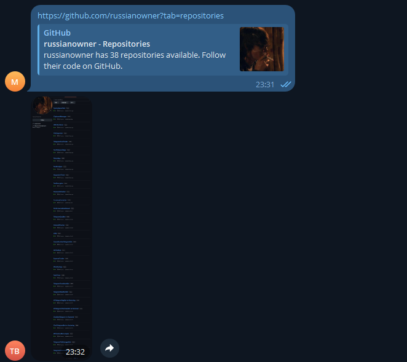

# Telegram Screenshot Bot (Console)
---
- Бот для телеграм, который принимает ссылку на сайт и присылает скриншот страницы
---
- A telegram bot that accepts a link to a website and sends a screenshot of the page
---
## О проекте:
- Консольная конфигурация: вводим токен бота
- Скриншоты сайтов любого URL
- Headless браузер PuppeteerSharp
- Временные файлы хранятся в системной папке Temp
- Все через телеграм
---
## About the project:
- Console configuration: enter the bot token
- Screenshots of websites of any URL
- Headless browser PuppeteerSharp
- Temporary files are stored in the Temp system folder
- All via telegram
---
## Как запустить:
- Клонируем репозиторий
- Открываем в Visual Studio
- Открываем проект
- Вводим токен бота
- Скидываем ссылку на сайт в бота
- Получаем скриншот
---
## How to launch:
- Cloning the repository
- Open in Visual Studio
- We are opening a project
- Enter the bot token
- We drop the link to the website in the bot
- We get a screenshot
---

---